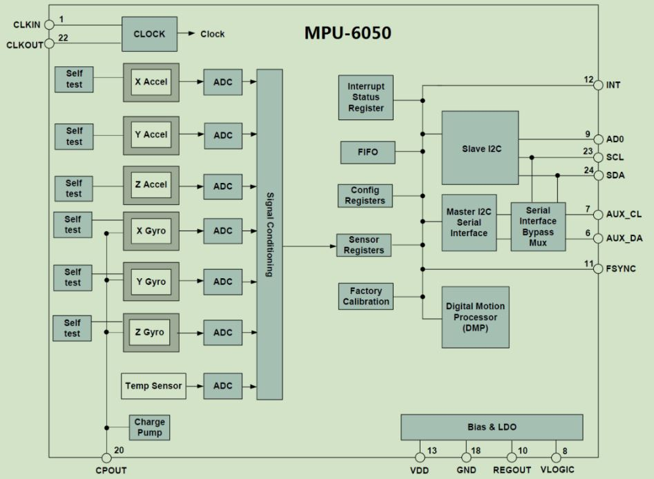
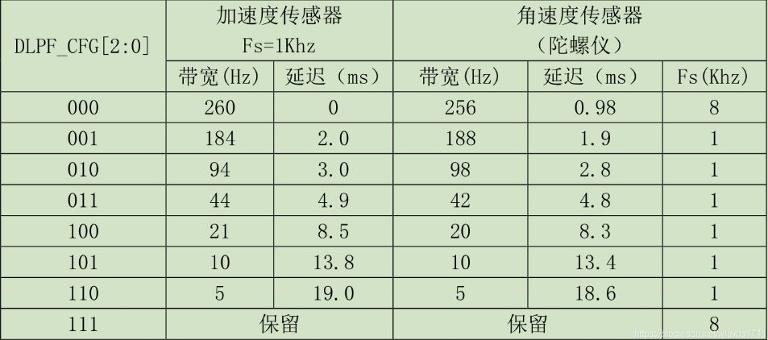

# STM32 HardWare MPU6050/MPU9250

# 1. MPU6050

MPU6050是InvenSense公司推出的全球首款整合性6轴运动处理组件，内带3轴陀螺仪和3轴加速度传感器，并且含有一个IIC接口，可用于连接外部磁力传感器，利用自带数字运动处理器（DMP: Digital Motion Processor）硬件加速引擎，通过IIC接口，可以向应用端输出完整的9轴姿态融合演算数据。

### MPU6050 框图



> - `SCL` 和 `SDA` 是连接 MCU 的 IIC 接口，MCU 通过这个 IIC 接口来控制 MPU6050。
> - 另有一个 IIC 接口：`AUX_CL` 和 `AUX_DA`，这个接口可用来连接外部从设备，比如磁力计（MPU6050内部无磁力计，会导致测得的 yaw 轴角度产生漂移），可以组成一个九轴传感器。
> - `VLOGIC` 是 IO 口电压，该引脚最低可以到 1.8V，一般直接接 VDD 即可。
> - `AD0` 是从 IIC 接口（接 MCU）的地址控制引脚，该引脚控制 IIC 地址的最低位。如果接 GND，则 MPU6050 的 IIC 地址是：`0X68`，如果接 VDD，则是`0X69`。

### MPU6050 寄存器简介

#### 电源管理寄存器(`0x6B`)


> - `DEVICE_RESET` 位用来控制复位，设置为 1，复位 MPU6050，复位结束后，MPU硬件自动清零该位。
> - `SLEEEP` 位用于控制 MPU6050 的工作模式，复位后，该位为 1，即进入了睡眠模式（低功耗），要清零该位以进入正常工作模式。
> - `TEMP_DIS` 用于设置是否使能温度传感器，设置为 0，则使能。
> - `CLKSEL[2:0]`用于选择系统时钟源
>   
>
> 默认使用内部 8M RC ，精度不高，所以一般选择 X/Y/Z 轴陀螺作为参考的 `PLL` 作为时钟源，一般设置 `CLKSEL=001` 即可。

#### 陀螺仪配置寄存器（`0x1B`）


> - `FS_SEL[1:0]`用于设置陀螺仪的满量程范围：0，±250°/S；1，±500°/S；2，±1000°/S；3，±2000°/S；
>
>   一般设置为 3，即 ±2000°/S，陀螺仪的 ADC 为 16 位分辨率，得到灵敏度为：65536/4000=16.4LSB/(°/S)。

#### 加速度传感器配置寄存器（`0X1C`）


> - `AFS_SEL[1:0]`用于设置加速度传感器的满量程范围：0，±2g；1，±4g；2，±8g；3，±16g；一般设置为 0，即±2g，加速度传感器的 ADC 是 16 位，得到灵敏度为：65536/4=16384LSB/g.

#### FIFO 使能寄存器（`0X23`）


该寄存器用于控制 FIFO 使能，在简单读取传感器数据的时候，可以不用 FIFO，设置对应位为 0 即可禁止 FIFO，设置为 1，则使能 FIFO。

#### 陀螺仪采样率分频寄存器（`0X19`）


该寄存器用于设置 MPU6050 的陀螺仪采样频率，计算公式为：
$$
采样频率 = \frac{陀螺仪输出频率}{1+SMPLRT\_DIV}
$$
陀螺仪的输出频率与数字低通滤波器（DLPF）的设置有关，当 `DLPF_CFG=0/7` 的时候，频率为 8Khz，其他情况是 1Khz。 DLPF 滤波频率一般设置为采样率的一半。

采样率假定设置为 50Hz，那么 `SMPLRT_DIV=1000/50-1=19`。                       

#### 配置寄存器（`0X1A`）


用于设置 DLPF 数字低通滤波器：



> 加速度传感器，输出速率（Fs）固定是 1Khz，而角速度传感器的输出速率（Fs），则根据 `DLPF_CFG` 的配置有所不同。
>
> 一般设置角速度传感器的带宽为其采样率的一半，如果设置采样率为 50Hz，则带宽就应该设置为 25Hz，取近似值 20Hz 则设置 `DLPF_CFG=100`。

#### 陀螺仪数据输出寄存器（`0X43`~`0X48`）


#### 加速度传感器数据输出寄存器（`0X3B`~`0X40`）


#### 温度传感器数据输出寄存器（`0X41`~`0X42`）


> 温度换算公式为：
> $$
> Temperature = 36.53 + \frac{regval}{340}
> $$
> 其中，`Temperature`为计算得到的温度值，单位为$℃$，`regval`为从`0X41`和`0X42`读到的温度传感器值。

### MPU6050 驱动移植

#### DMP 库简介

MPU6050 自带了数字运动处理器，即 DMP，并且，InvenSense 提供了一个 MPU6050 的嵌入式运动驱动库，结合 MPU6050 的 DMP，可以将加速度传感器和角速度传感器的原始数据，直接转换成四元数输出，得到四元数之后就可以很方便的计算出欧拉角：航向角（yaw）、横滚角（roll）和俯仰角（pitch）。

使用 MPU6050 的 DMP 输出的四元数是 q30 格式的，也就是浮点数放大了 2 的 30 次方倍。在换算成欧拉角之前，必须先将其转换为浮点数，也就是除以 2 的 30 次方，然后再进行计算。

```c
        q0=quat[0] / q30; //q30 格式转换为浮点数
        q1=quat[1] / q30;
        q2=quat[2] / q30;
        q3=quat[3] / q30;
        //计算得到俯仰角/横滚角/航向角
        pitch=asin(-2 * q1 * q3 + 2 * q0* q2)* 57.3; //俯仰角
        roll=atan2(2 * q2 * q3 + 2 * q0 * q1, -2 * q1 * q1 - 2 * q2* q2 + 1)* 57.3; //横滚角
        yaw=atan2(2*(q1q2 + q0q3),q0q0+q1q1-q2q2-q3q3) * 57.3; //航向角
```

#### DMP 库移植

[HAL库硬件IIC_MPU6050_DMP移植_unsupported software product rev_DO_Tonight的博客-CSDN博客](https://blog.csdn.net/weixin_51341083/article/details/117475886?ops_request_misc=%7B%22request%5Fid%22%3A%22169754327716800226589059%22%2C%22scm%22%3A%2220140713.130102334..%22%7D&request_id=169754327716800226589059&biz_id=0&utm_medium=distribute.pc_search_result.none-task-blog-2~all~top_positive~default-1-117475886-null-null.142^v96^pc_search_result_base7&utm_term=mpu6050 dmp移植&spm=1018.2226.3001.4187)
